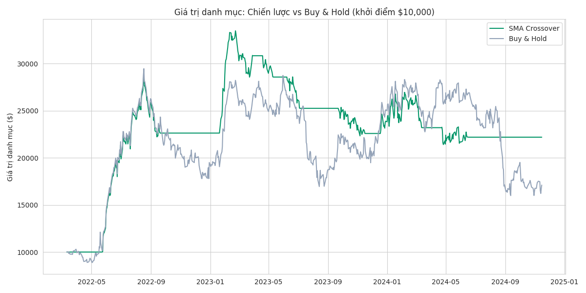

# 📉 Stock Price Forecasting & Trading Strategy Backtest

Dự báo giá cổ phiếu bằng ARIMA/Prophet, backtest chiến lược giao dịch SMA
Crossover với đánh giá chuẩn ngành quant (Sharpe Ratio, Max Drawdown) — có
kiểm tra độ nhạy tham số để tránh overfitting vào dữ liệu lịch sử.

**🔗 Demo trực tiếp**: _[thêm link Streamlit Cloud sau khi deploy]_



## Vấn đề nghiên cứu

Hai câu hỏi cốt lõi của quant research:
1. **Có thể dự báo giá cổ phiếu tốt hơn "đoán bừa" không?** — so sánh các
   phương pháp time series với baseline đơn giản nhất
2. **Một chiến lược giao dịch có thực sự tạo ra giá trị không?** — so với
   việc chỉ mua và giữ (Buy & Hold), có tính đến rủi ro và chi phí giao dịch

## Dữ liệu

Dữ liệu giá OHLCV (Open/High/Low/Close/Volume) theo ngày, cấu trúc chuẩn
tương tự dữ liệu từ Yahoo Finance / các API giá chứng khoán phổ biến.

> **Lưu ý**: Repo này đi kèm dữ liệu **mẫu (synthetic)** ở `data/raw/`, mô
> phỏng đặc điểm thống kê thật của giá cổ phiếu (volatility clustering, đuôi
> phân phối dày) để chạy demo ngay. Để dùng dữ liệu thật:
> ```bash
> pip install yfinance
> python3 -c "import yfinance as yf; yf.download('AAPL', start='2022-01-01', end='2024-01-01').to_csv('data/raw/stock_prices.csv')"
> ```

## Phương pháp

| Bước | Kỹ thuật | Mục đích |
|---|---|---|
| Data Overview | Kiểm tra logic OHLC hợp lệ | Đảm bảo dữ liệu đáng tin |
| Technical Analysis | SMA, RSI, Volatility, ADF stationarity test | Hiểu đặc điểm thống kê của dữ liệu trước khi mô hình hóa |
| **Forecasting** | ARIMA, Prophet, so với Naive Baseline | Đánh giá khả năng dự báo thực sự (không chỉ chạy model cho có) |
| **Backtest** | SMA Crossover, Sharpe Ratio, Max Drawdown, parameter sensitivity | Đánh giá chiến lược giao dịch đúng chuẩn quant |

## Kết quả chính (trên dữ liệu mẫu)

### Forecasting (30 ngày dự báo)

| Model | MAE | RMSE | MAPE |
|---|---|---|---|
| Naive Baseline | 6.11 | 7.72 | 2.92% |
| **ARIMA(5,1,0)** | **5.02** | **6.33** | **2.39%** |
| Prophet | 11.35 | 13.54 | 5.29% |

**Insight**: ARIMA đánh bại baseline (~18% giảm RMSE), cho thấy có
autocorrelation ngắn hạn khai thác được. Prophet — thiết kế tối ưu cho dữ
liệu có seasonality rõ ràng — hoạt động **kém hơn cả baseline** trên giá cổ
phiếu, vì giá gần với random walk, thiếu pattern mùa vụ để khai thác. Bài học:
không có model "tốt nhất" cho mọi loại dữ liệu.

### Backtest (SMA 20/50 Crossover)

| Chiến lược | Total Return | Sharpe Ratio | Max Drawdown |
|---|---|---|---|
| **SMA Crossover** | **+122.0%** | **1.08** | **-36.1%** |
| Buy & Hold | +71.1% | 0.45 | -45.7% |

**Insight**: chiến lược SMA Crossover vượt trội cả về lợi nhuận VÀ rủi ro —
Sharpe Ratio cao hơn 2.4 lần, Max Drawdown thấp hơn. Đã kiểm tra độ nhạy qua
nhiều cặp tham số (short/long window) khác nhau để xác nhận kết quả không
phải ngẫu nhiên may mắn từ 1 cặp tham số cụ thể.

*(Số liệu từ dữ liệu mẫu — cần chạy lại trên dữ liệu thị trường thật trước
khi dùng cho quyết định đầu tư thực tế.)*

## Cấu trúc project

```
stock-forecasting-backtest/
├── data/
│   ├── raw/                            # Dữ liệu giá thô (mẫu)
│   └── processed/                       # Dữ liệu đã làm sạch, đã tính chỉ báo
├── notebooks/
│   ├── 01_data_overview.ipynb           # Khám phá & làm sạch dữ liệu OHLCV
│   ├── 02_technical_analysis.ipynb      # SMA/RSI/Volatility, kiểm định stationarity
│   ├── 03_price_forecasting.ipynb       # ARIMA vs Prophet vs Naive Baseline
│   ├── 04_strategy_backtest.ipynb       # SMA Crossover, Sharpe Ratio, sensitivity test
│   └── 05_conclusion.ipynb               # Tổng hợp, giới hạn, định hướng tiếp theo
├── src/
│   ├── data_processing.py                # Load & làm sạch dữ liệu OHLCV
│   ├── features.py                        # Technical indicators (SMA, RSI, Volatility)
│   ├── forecasting.py                      # ARIMA, Prophet, đánh giá forecast
│   ├── backtest.py                          # Backtest engine, performance metrics
│   └── eda.py                                # Sinh biểu đồ EDA
├── dashboard/
│   └── app.py                                # Streamlit dashboard tương tác
├── tests/
│   └── test_pipeline.py                       # Unit test (pytest)
├── outputs/                                    # Biểu đồ, bảng so sánh
├── reports/
│   └── insights_summary.md                      # Báo cáo tóm tắt
├── requirements.txt
└── README.md
```

## Cách chạy

```bash
# 1. Cài dependencies
pip install -r requirements.txt

# 2. (Đã có sẵn dữ liệu mẫu trong data/raw/. Để dùng dữ liệu thật, xem phần Dữ liệu ở trên)

# 3. Chạy pipeline đầy đủ
python3 src/data_processing.py
python3 src/features.py
python3 -m src.eda
python3 -m src.forecasting
python3 -m src.backtest

# 4. Mở các notebook theo thứ tự (01 -> 05)
jupyter notebook notebooks/01_data_overview.ipynb

# 5. Chạy dashboard tương tác (có slider chỉnh tham số SMA trực tiếp)
streamlit run dashboard/app.py

# 6. Chạy test
pytest tests/ -v
```

## Công nghệ sử dụng

`Python` `Pandas` `NumPy` `Statsmodels (ARIMA)` `Prophet` `Scikit-learn`
`Matplotlib/Seaborn` `Plotly` `Streamlit` `Pytest`

## Kỹ năng thể hiện qua dự án

- Xử lý đúng chuẩn **time series**: train/test split theo thời gian (không
  random split — tránh data leakage), kiểm định stationarity (ADF test)
- So sánh model với **baseline bắt buộc** trước khi kết luận model "tốt"
- Backtest đúng chuẩn quant: tránh **look-ahead bias** (shift tín hiệu sang
  ngày sau), tính **transaction cost**, đánh giá bằng **Sharpe Ratio/Max
  Drawdown** thay vì chỉ nhìn tổng lợi nhuận
- **Parameter sensitivity analysis** để tránh overfitting chiến lược vào dữ
  liệu lịch sử

## Định hướng mở rộng

- Walk-forward backtesting (huấn luyện lại model định kỳ, gần thực tế hơn)
- Thêm chỉ báo kỹ thuật khác (MACD, Bollinger Bands)
- Thử ML-based forecasting (LSTM, XGBoost với feature kỹ thuật)
- Test trên nhiều mã cổ phiếu/nhiều giai đoạn thị trường (bull/bear/sideways)

## Tác giả

*Nguyễn Đức Hiếu* — Data Analyst / dự án cá nhân phục vụ ứng tuyển vị trí Fresher.
[[LinkedIn](https://www.linkedin.com/in/%C4%91%E1%BB%A9c-hi%E1%BA%BFu-nguy%E1%BB%85n-37166340b/)] · [https://github.com/DucHieu004] · [nguyenduchieu21052004@gmail.com]
